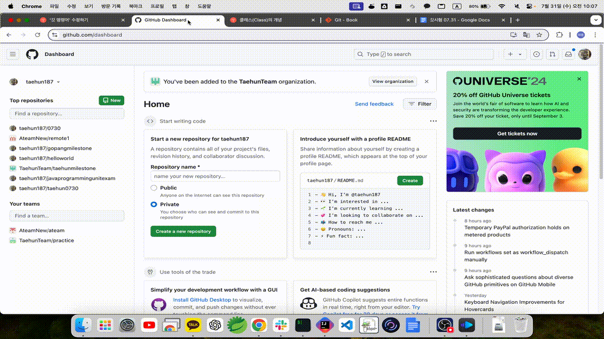

# Git 단위평가 항목
### 조건
* STS4 IDE를 사용한 Java project
* 모든 local repository는 remote repository와 함께 운용됨

## 평가 문제
1. remote[GitHub] empty repo 생성

2. git init & git push

3. 별도의 git local branch 생성 -> remote repo 생성

4. fast forward merge

5. 3 way merge - conflict merge가 발생해야 함

6. rebase - conflict merge가 발생해야 함

7. remote branch[GitHub]와 local branch 충돌 해결

8. local branch 및 remote branch 삭제

9. git undo[amend 옵션 사용]

10. team - collaborate : 팀원마다 브랜치가 할당. 이후 main 브랜치로 Merge
